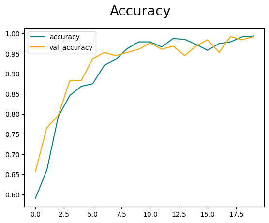
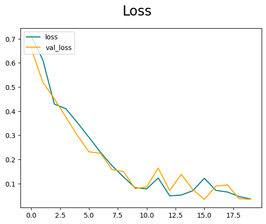
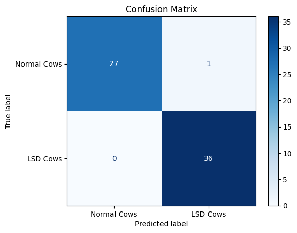

```markdown
# 🐄 Lumpy Skin Disease Classification using TensorFlow

## 🧠 Overview

This project presents an image classification model for detecting **Lumpy Skin Disease (LSD)** in cows using a Convolutional Neural Network (CNN) built with TensorFlow.

The model classifies cow skin images into two categories:

- ✅ **Normal Skin**
- ❌ **Lumpy Skin Disease**

Lumpy Skin Disease is a viral illness in cattle that causes nodules on the skin. Early detection using deep learning models can support timely diagnosis and disease control.

---

## 📁 Dataset

The dataset is organized into two folders:

```
dataset/
├── class1/     # Images of cows with normal skin
└── class2/      # Images of cows with LSD
```

### 🔧 Preprocessing Steps:
- Resized all images to a standard dimension
- Normalized pixel values
- Applied data augmentation (flip, rotation, etc.)

---

## 🧪 Model Architecture

A simple CNN was implemented using TensorFlow/Keras, with the following components:

- Multiple Convolutional Layers (ReLU activation)  
- MaxPooling Layers  
- Dropout Layers for regularization  
- Fully Connected (Dense) Layers  
- Output Layer with Softmax Activation

**Training configuration:**
- Epochs: 20  
- Validation Split: 20%  
- EarlyStopping to prevent overfitting

---

## 📊 Results & Evaluation

### ✅ Accuracy Curve

The model achieved strong performance on both training and validation sets:



---

### 📉 Loss Curve

Smooth and stable loss curves indicate successful training with no major overfitting:



---

### 🔍 Confusion Matrix

The confusion matrix shows the classification performance on the test dataset:



| Metric             | Value   |
|--------------------|---------|
| **Accuracy**       | ~98.7%  |
| **F1 Score**       | 0.98    |
| **Precision/Recall** | High for both classes |

---

## 🧰 Requirements

Install dependencies using:

```bash
pip install tensorflow matplotlib numpy scikit-learn
```

---

## ▶️ How to Run

1. Clone the repository:

```bash
git clone https://github.com/yourusername/Lumpy-Disease-Classification-TensorFlow.git
cd LSD-Classification-TensorFlow
```

2. Prepare your dataset:  
Place your image data in the `dataset/` folder, split into `class1/` and `class2/` subfolders.

3. Run the notebook:

```bash
jupyter notebook model_train.ipynb
```

---

## 📌 Notes

- You can replace the dataset with your own as long as it follows the same folder structure.
- The current model is relatively lightweight and can run on modest hardware.
- Consider trying transfer learning for potentially even higher accuracy.

---

## 👤 Author

This project was developed as part of a University course and to explore the possibilities of machine learning on the farming sector.

---

## 📜 License

This project is open-source and available under the [MIT License](LICENSE).
```
